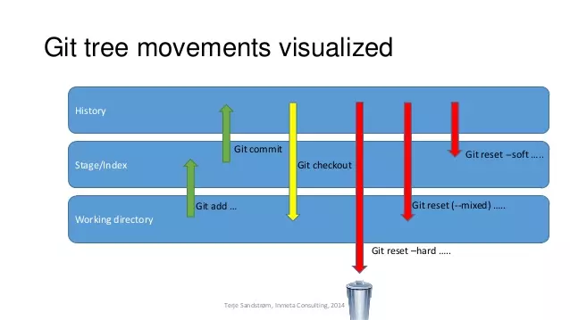
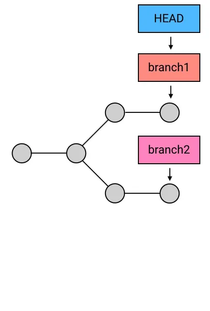

# Git


**概念 https://www.cnblogs.com/qdhxhz/p/9757390.html**


**Git文件只有3种状态：已修改（modified）,已暂存（staged）,已提交(committed)**


**状态变化的流程图**


## config 

- ` git config --list`

- ` git config --global user.name "你的用户名" `

- ` git config --global user.email "你的邮箱" `

- ` git config --global --unset "错误的key删除掉"`

## log

- `git reflog` ：查看操作历史
- `git log` 标准输出
- `git log –-graph` 图形化输出
- `git log --oneline` 简单输出
	- `git log --pretty=oneline`   


## clone

- `git clone [地址]`

- `git clone -b dev [地址]` 只克隆`dev`分支

- `--depth` 不需要下载整个仓储, 只要最新的一次提交


## fetch 

- 从另一个仓库下载 **对象** 和 **引用**
- 只是把远程仓库的内容获取到本地仓库, 并没有把两者的内容进行合并


## pull

- `git pull [options] [<repository>, [<refspec>...]]` : 完整格式
- 作用是：取回远程主机某个分支的更新，再与本地的指定分支合并，它的完整格式稍稍有点复杂。
    - `git pull`默认是`git fetch` + `git merge FETCH_HEAD`的缩写，
    - 更准确的说`git pull`使用的的是`--rebase`, 它运行`git rebase`而不是`git merge`
- 取回`origin`主机的`next`分支, 与本地的`dev`分支合并
    - `git pull origin next:dev`
- 如果是和当前分支合并，冒号后面的部分可以省略
    - `git pull origin next`
        - 相当于以下的两个步骤
        -  `git fetch origin` (获取远端的分支)
	    -  `git merge origin/next` （合并远端分支)
- 默认还有远程跟踪分支的说法...        


## push 

- `git push [地址] master`
- `git push origin master`


## status 

- `git status ` : 查看当前工作目录的状态，是已经放到暂存区，还是提交到仓库了。
- `git status -s ` 查看简要的状态信息


## stage 

- `git add ./file.txt`:将当前目录中的`file.txt`添加 **到暂存区**
  
    - >..." to update what will be committed`
    
- `git add .` 将当前目录 **所有文件**都添加的暂存区.

- `git add JavaBase/*` 将 `JavaBase` 里所有的文件添加到暂存区。

- `git reset head  JavaBase/demo.java` 从暂存区退回到工作，**但是**，修改的内容还存在，通过 `git diff JavaBase/demo.java` 可以查看到修改的内容。

## checkout

- `git checkout -- index.html`  清空暂存区
  
- `use "git checkout -- <file>..." to discard changes in working directory`
  
  

## commit 

- `git commit` 进入到vim模式编写提交记录

- `git commit -m '快速编写提交记录， 如果没有空格或者其他符号，可以不加单引号' ` 
- `git commit --amend`
- `git commit -m  -c`


## branch 

- `git branch`: 查看有多少分支
- `git branch -a`: 查看隐藏分支
- `git branch dev`: 创建了一个名为dev的分支
- `git checkout dev`: 切换到dev分支
- `git checkout -b dev`: 创建并切换到指定分支
- `git merge dev` 表示将当前分支与dev分支合并.  
- `git branch -d dev` 不要在dev分支执行这个命令，在别的的分支执行.
- `git ls-files -u` 查看冲突未处理的文件列表


## merge 


## diff

- `git diff --check` 快速查看有冲突的文件


## rebase


- 基于远程分支`origin`创建`mywork`分支，你在`mywork`分支有提交，此刻`origin`分支已经有人做了修改并提交。此时，可以用`pull`把`origin`分支上的修改拉取下来和`mywork`进行合并。如下图所示：


- 如果想让`mywork`分支历史看起来像没有经过任何合并一样，可以用`git rebase`, 命令如下：
    - `git checkout mywork`
    - `git rebase orgin`
- 这些命令会把`mywork`分支里的每个提交(commit)取消掉，并且把他们临时保存为补丁(patch), 然后把`mywork`分支更新到最新的`origin`分支，最后把保存的这些补丁应用到`mywork`分支上。
    - 保存的补丁放在`.git/rebase`目录中


- 当`mywork`分支更新之后，它会只想这些新创建的提交(commit), 而那些老的提交会被丢弃。如果运行垃圾收集命令(`pruning garbage collection`)，这些丢弃的提交就会被删除。        

- ```bash
    git rebase -i HEAD~3

    pick = use commit
    reword = user commit, but edit the commit message
    edit = use commit, but stop for amending
    squash = use commit, but meld into previous commit
    fixup = like "squash", but discard this commit's message
    exec = run command (the rest of the line) using shell
    drop = remove commit

    git rebase (--continue | --abort | --skip)

    # error: cannot 'fixup' without a previous commit
    ```

- 删除`commit`

- 合并`commit`

- 从指定基点创建分支

- 合并`dev`的部分代码到`master`


## remote

- `git remote` :可以查看已添加的远程主机
- `git remote -v`：显示所有仓库
- `git remote add [主机名称] [远程仓库地址]`添加远程主机，即给远程主机起个别名，方便使用
- `git remote rm [主机名称]` 命令用于删除远程主机。
- `git remote show [主机名称]` 可以查看远程主机的信息
- `git push origin --delete`

## revert


## stash

- [保存当前的工作现场](https://zhuanlan.zhihu.com/p/28608106)
- 使用git stash保存当前的工作现场，那么就可以切换到其他分支进行工作，或者在当前分支上完成其他紧急的工作，比如修订一个bug测试提交。


## checkout


## reset


[reset 的本质：移动 HEAD 以及它所指向的 branch](https://www.jianshu.com/p/c2ec5f06cf1a)


```markdown
this will reset the current branch head to the selected commit, and update the working tree and the index according to the selected mode:

Soft:  files won't change, differences will be staged for commit.
	保留工作目录，并把重置 HEAD 所带来的新的差异放进暂存区
	会在重置 HEAD 和 branch 时，保留工作目录和暂存区中的内容，并把重置 HEAD 所带来的新的差异放进暂存区。

Mixed: files won't change, differences won't be staged.
	保留工作目录，并清空暂存区
	默认使用 --mixed 参数。它的行为是：保留工作目录，并且清空暂存区。也就是说，工作目录的修改、暂存区的内容以及由 reset 所导致的新的文件差异，都会被放进工作目录。简而言之，就是「把所有差异都混合（mixed）放在工作目录中」

Hard:  files will be reverted to the state of the selected commit,warning: any local changes will be lost.
	重置stage区和工作目录
	会在重置 HEAD 和branch的同时，重置stage区和工作目录里的内容。当你在 reset 后面加了 --hard 参数时，你的stage区和工作目录里的内容会被完全重置为和HEAD的新位置相同的内容。换句话说，就是你的没有commit的修改会被全部擦掉。

Keep:  files will be reverted to the state of the selected commit,but local changes will be kept intact.
```




- `git reset --hard <Head>` :回退到某个具体的版本。
    - 
- `git reflog`:配合命令查看历史操作来进行回退 


## rm

- `git rm --cached index.txt` 删除`index.txt`的跟踪，并保留在本地。
- `git rm --f index.txt`     删除`index.txt`的跟踪，并且删除本地文件。


## .gitignore

- `.gitignore` 和 `.git`同级目录    
- `/node_modules` 忽略某个目录
- `/css/index.css` 忽略某个文件
- `/css/*.css` 忽略某一类文件
- `*.*` 忽略目录下所有文件
- `doc/a.txt`
- `doc/**/a.txt`
- `#`号表示注释


## cherry-pick


## 补充
- 如果我对某文件进行了修改，但我不想要push到远程仓库，同时我又想获取最新的修改记录
    - `git stash save`
    - `git pull --rebase`
    
- 如果暂存内容现在不想在当前分支恢复了，而是想单独起一个分支
    - `git stash branch [newBranchName]`

- 想要查看当前工作区与暂存状态内容区别
    - `git stash show -p stash{0}`

- 本地代码已经commit后，解决与远程代码冲突问题
```markdown
    # 获取远端库最新信息 【分支名称】
    git fetch origin [master]

    # 做比较
    git diff [本地分支名] origin/[远程分支名]

    # 拉取最新代码，同时会让你merge冲突
    git pull
```

- 和远程仓库关联
```markdown
    git init
    git add .
    git commmint -m 'init'

    将本地的仓库关联到github上
    git remote add origin https://github.com/luogeger/...
    
    上传github之前，要先pull一下
    git pull origin master
    
    最后push到远程仓库
    git push -u origin master
```

- ssh的方式
    - `ssh-keygen -t rsa` 创建密钥
    
    - tip: 已经存在版本库了，但是要批量取消版本跟踪，但是文件不删除，怎么操作   
