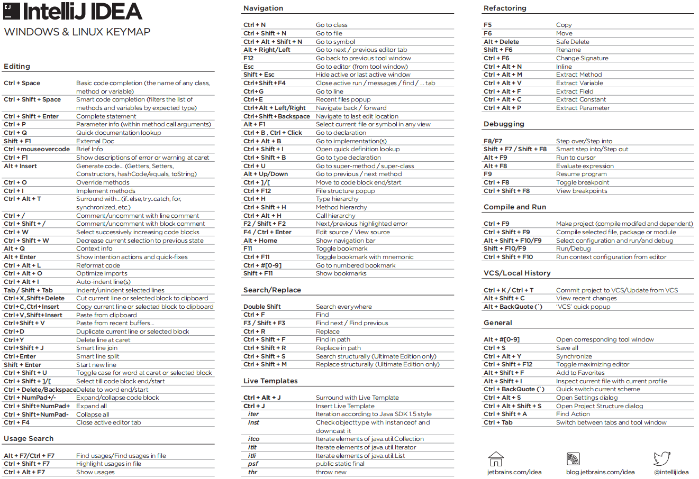

this will reset the current branch head to the selected commit,
and update the working tree and the index according to the selected mode:

Soft:  files won't change, differences will be staged for commit.

Mixed: files won't change, differences won't be staged.

Hard:  files will be reverted to the state of the selected commit,
       warning: any local changes will be lost.
       
Keep:  files will be reverted to the state of the selected commit,
       but local changes will be kept intact.

# IntelliJ IDEA windows keymap

### Editing
- **Alt + J** 
    -  tip选中同样的单词
- **Ctrl + Space** `Basic code completion (the name of any class, method or variable)`
    - 基本代码完成（任何类，方法或变量的名称）
- **Ctrl + Shift + Space** `Smart code completion (filters the list of methods and variables by expected type)`
    - 智能代码完成, 按预期类型过滤方法和变量的列表
- **Ctrl + Shift + Enter** `Complete statement`
    - 完整的陈述 `所在行代码补充完整，例如：行尾需要分号，但是光标在中间，不用把光标移到行尾添加分号。`
- **Ctrl + P** `Parameter info (within method call arguments)`
    - 参数信息（在方法调用参数内）
- **Ctrl + Q** `Quick documentation lookup`
    - 光标停留在类上，快速查看类的文档信息
- **Shift + F1** `External Doc`
    - 外部文件
- **Ctrl + mouse over code** `Brief Info`
    - Ctrl + 光标悬停： 摘要信息
- **Ctrl + F1** `Show descriptions of error or warning at caret`
    - 在插入符号处显示错误或警告的描述
- **Alt + Insert** `Generate code... (Getters, Setters, Constructors, hashCode/equals, toString)`
- **Ctrl + O** `Override methods`
    - 重写方法
- **Ctrl + I** `Implement methods`
    - 实现方法
- **Ctrl + Alt + T** `Surround with… (if..else, try..catch, for, synchronized, etc.)`
    - 用括号内的语句代码进行环绕
- **Ctrl + /** `Comment/uncomment with line comment`
    - 行注释
- **Ctrl + Shift + /** `Comment/uncomment with block comment`
    - 块注释
- **Ctrl + W** `Select successively increasing code blocks`
    - 选择连续增加的代码块
- **Ctrl + Shift + W** `Decrease current selection to previous state`
    - 将当前选择减小到以前的状态，和Ctrl + W 相反
- **Alt + Q** `Context info`
    - 上下文信息
- **Alt + Enter** `Show intention actions and quick-fixes`
    - 万能快捷键：显示意图动作和快速修正
- **Ctrl + Alt + L** `Reformat code`
    - 格式化代码
- **Ctrl + Alt + O** `Optimize imports`
    - 优化导入
- **Ctrl + Alt + I** `Auto-indent line(s)`
    - 自动缩进行
- **Tab / Shift + Tab** `Indent/unindent selected lines`
    - 缩进当前行
- **Ctrl + X , Shift + Delete** `Cut current line or selected block to clipboard`
    - 剪切
- **Ctrl + C , Ctrl + Insert** `Copy current line or selected block to clipboard`
    - 复制
- **Ctrl + V , Shift + Insert** `Paste from clipboard`
    - 粘贴
- **Ctrl + Shift + V** `Paste from recent buffers...`
    - 查看最近5次复制的具体内容
- **Ctrl + D** `Duplicate current line or selected block`
    - 复制当前行，或是选中的内容
- **Ctrl + Y** `Delete line at caret`
    - 删除光标所在行
- **Ctrl + Shift + J** `Smart line join`
- **Ctrl + Enter** `Smart line split`
- **Shift + Enter** `Start new line`
    - 开始新的一行
- **Ctrl + Shift + U** `Toggle case for word at caret or selected block`
    - 切换光标或所选块中单词的大小写
- **Ctrl + Shift + ]/[** `Select till code block end/start`
    - 选择到代码块结束/开始的地方
- **Ctrl + Delete/Backspace** `Delete to word end/start`
    - 删除到单词结尾/开始的地方
- **Ctrl + NumPad+/-** `Expand/collapse code block`
    - 展开/折叠代码块
- **Ctrl + Shift + NumPad+** `Expand all`
    - 展开所有的代码块
- **Ctrl + Shift + NumPad-** `Collapse all`
    - 折叠所有的代码块
- **Ctrl + F4** `Close active editor tab`
    - 关闭当前编辑的tab（窗口）

### Usage Search
- **Alt + F7/Ctrl + F7** `Find usages/Find usages in file`
- **Ctrl + Shift + F7** `Highlight usages in file`
- **Ctrl + Alt + F7** `Show usages`

### Navigation
- **Ctrl + N** `Go to class`
  - 查找类，默认是查找项目里的类，也可以查找jar包里的类
- **Ctrl + Shift + N** `Go to file`
  - 查看找文件
- **Ctrl + Alt + Shift + N** `Go to symbol`
    - 模糊搜索方法
- **Alt + Right/Left** `Go to next / previous editor tab`
  - 在编辑栏左右切换
- **F12** `Go back to previous tool window`
  - 光标回到工具栏
- **Esc** `Go to editor (from tool window)`
  - 光标回到编辑栏
- **Shift + Esc** `Hide active or last active window`
  - 隐藏最后使用的工具栏，如果只有一个的话，就隐藏它
- **Ctrl + Shift + F4** `Close active run / messages / find / ... tab`
- **Ctrl + G** `Go to line`
- **Ctrl + E** `Recent files popup`
- **Ctrl + Alt + Left/Right** `Navigate back / forward`
- **Ctrl + Shift + Backspace** `Navigate to last edit location`
- **Alt + F1** `Select current file or symbol in any view`
    - 在任何视图中选中当前文件
- **Ctrl + B , Ctrl + Click** `Go to declaration`
- **Ctrl + Alt + B** `Go to implementation(s)`
- **Ctrl + Shift + I** `Open quick definition lookup`
- **Ctrl + Shift + B** `Go to type declaration`
- **Ctrl + U** `Go to super-method / super-class`
- **Alt + Up/Down** `Go to previous / next method`
- **Ctrl + ]/[** `Move to code block end/start`
- **Ctrl + F12** `File structure popup`
- **Ctrl + H** `Type hierarchy`
- **Ctrl + Shift + H** `Method hierarchy`
- **Ctrl + Alt + H** `Call hierarchy`
- **F2 / Shift + F2** `Next/previous highlighted error`
- **F4 / Ctrl + Enter** `Edit source / View source`
- **Alt + Home** `Show navigation bar`
- **F11** `Toggle bookmark`
- **Ctrl + F11** `Toggle bookmark with mnemonic`
- **Ctrl + #[0-9]** `Go to numbered bookmark`
- **Shift + F11** `Show bookmarks`

### Search/Replace
- **Double Shift** `Search everywhere`
- **Ctrl + F** `Find`
- **F3 / Shift + F3** `Find next / Find previous`
- **Ctrl + R** `Replace`
- **Ctrl + Shift + F** `Find in path`
- **Ctrl + Shift + R** `Replace in path`
- **Ctrl + Shift + S** `Search structurally (Ultimate Edition only)`
- **Ctrl + Shift + M** `Replace structurally (Ultimate Edition only)`

### Live Templates
- **Ctrl + Alt + J** `Surround with Live Template`
- **Ctrl + J** `Insert Live Template`
- **iter** `Iteration according to Java SDK 1.5 style`
- **inst** `Check object type with instanceof and downcast it`
- **itco** `Iterate elements of java.util.Collection`
- **itit** `Iterate elements of java.util.Iterator`
- **itli** `Iterate elements of java.util.List`
- **psf** `public static final`
- **thr** `throw new`    

### Refactoring
- **F5** ` Copy`
- **F6** `Move`
- **Alt + Delete** `Safe Delete`
- **Shift + F6** `Rename`
- **Ctrl + F6** `Change Signature`
- **Ctrl + Alt + N** `Inline`
- **Ctrl + Alt + M** `Extract Method`
- **Ctrl + Alt + V** `Extract Variable`
- **Ctrl + Alt + F** `Extract Field`
- **Ctrl + Alt + C** `Extract Constant` 
- **Ctrl + Alt + P** `Extract Parameter`

### Debugging
- **F8/F7** `Step over/Step into`
- **Shift + F7 / Shift + F8** `Smart step into/Step out`
- **Alt + F9** `Run to cursor`
- **Alt + F8** `Evaluate expression`
- **F9** `Resume program`
- **Ctrl + F8** `Toggle breakpoint`
- **Ctrl + Shift + F8** `View breakpoints`

### Compile and Run
- **Ctrl + F9** `Make project (compile modifed and dependent)`
- **Ctrl + Shift + F9** `Compile selected file, package or module`
- **Alt + Shift + F10/F9** `Select configuration and run/and debug`
- **Shift + F10/F9** `Run/Debug`
- **Ctrl + Shift + F10** `Run context configuration from editor`

### VCS/Local History
- **Ctrl + K / Ctrl + T** `Commit project to VCS/Update from VCS`
- **Alt + Shift + C** `View recent changes`
- **Alt + BackQuote (\`)** `‘VCS’ quick popup`

### General
- **Alt + #[0-9]** `Open corresponding tool window`
- **Ctrl + S** `Save all`
- **Ctrl + Alt + Y** `Synchronize`
- **Ctrl + Shift + F12** `Toggle maximizing editor`
- **Alt + Shift + F** `Add to Favorites`
- **Alt + Shift + I** `Inspect current file with current profile`
- **Ctrl + BackQuote (\`)** `Quick switch current scheme`
- **Ctrl + Alt + S** `Open Settings dialog`
- **Ctrl + Alt + Shift + S** `Open Project Structure dialog`
- **Ctrl + Shift + A** `Find Action`
- **Ctrl + Tab** `Switch between tabs and tool window`   
    - 在标签和工具窗口之间切换 

